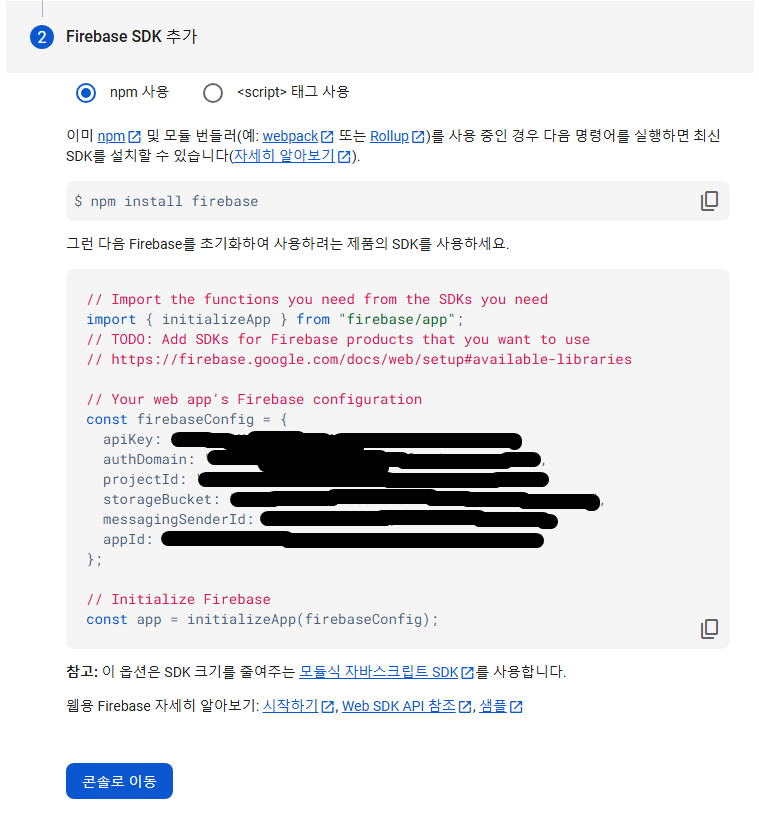

# 노마드 코더 트위터 클론 코딩
[강의 주소](https://nomadcoders.co/nwitter/lobby)

## 2강
### 1-install
1. vite
```cmd
npm create vite
```

1-2. select
* react

1-3. select
* typescript + wsc

2. run
```cmd
npm run dev
```

3. react-router-dom
```cmd
npm i react-router-dom@6.14.2
```

4. styled-reset
```cmd
npm i styled-reset
```

5. styled-components
```cmd
npm i styled-components@6.0.7 -D
```

### 2-learn
```
<Outlet />은 리액트 라우터(React Router)에서 사용하는 컴포넌트로, 중첩된 라우트를 렌더링하는 역할을 합니다. 주로 레이아웃 컴포넌트에 배치되며, 현재 활성화된 자식 라우트를 해당 위치에 렌더링할 때 사용됩니다.

1. 기본 개념
<Outlet />은 부모 라우트 내에서 정의된 자식 라우트가 렌더링될 자리를 표시합니다. 이를 통해 하나의 부모 레이아웃에 여러 자식 라우트를 중첩시킬 수 있습니다.

2. 예제
다음과 같은 라우트 구조를 예로 들어 설명해볼게요.

/dashboard → 대시보드 메인 화면
/dashboard/profile → 대시보드의 프로필 화면
/dashboard/settings → 대시보드의 설정 화면
먼저, App.js에서 라우트를 설정합니다.

javascript
코드 복사
import { BrowserRouter, Routes, Route } from 'react-router-dom';
import Dashboard from './Dashboard';
import Profile from './Profile';
import Settings from './Settings';

function App() {
  return (
    <BrowserRouter>
      <Routes>
        <Route path="dashboard" element={<Dashboard />}>
          <Route path="profile" element={<Profile />} />
          <Route path="settings" element={<Settings />} />
        </Route>
      </Routes>
    </BrowserRouter>
  );
}

export default App;
3. <Outlet /> 사용하기
이제 Dashboard 컴포넌트에서 <Outlet />을 사용하여 자식 라우트를 렌더링할 위치를 지정합니다.

javascript
코드 복사
import { Outlet, Link } from 'react-router-dom';

function Dashboard() {
  return (
    <div>
      <h1>Dashboard</h1>
      <nav>
        <Link to="profile">Profile</Link>
        <Link to="settings">Settings</Link>
      </nav>
      
      {/* 자식 라우트가 렌더링될 자리 */}
      <Outlet />
    </div>
  );
}

export default Dashboard;
Dashboard 컴포넌트는 기본 레이아웃을 제공하며, <Outlet />을 통해 자식 컴포넌트가 표시될 위치를 지정합니다.
이제 /dashboard/profile로 이동하면 <Outlet />에 Profile 컴포넌트가, /dashboard/settings로 이동하면 Settings 컴포넌트가 렌더링됩니다.
4. 장점
코드 분리: 부모와 자식 라우트의 UI를 분리하여 관리할 수 있습니다.
중첩 라우트 관리 용이: 레이아웃 컴포넌트 내에서 <Outlet />을 사용해 특정 부분만 자식 라우트에 맞게 변경할 수 있습니다.
<Outlet />을 사용하면 중첩 라우트를 손쉽게 렌더링하고 관리할 수 있어, 복잡한 네비게이션 구조에서도 깔끔하게 UI를 구성할 수 있습니다.
```

#### 2-3 firebase

* firebase
```cmd
npm install firebase@10.1.0
```

1. firebase 로그인 및 새 프로젝트 생성 <br>
 <br><br>

2. 개발 os 선택 <br>
 <br><br>

3. 앱 등록 <br>
 <br><br>

4. sdk 추가 <br>
 <br><br>

## 3강
### firebase 인증

1. 인증 클릭 <br>
 <br>
2. 이메일/비밀번호 클릭 <br>
 <br>
3. 사용설정 클릭 <br>
 <br>
4. 완료 <br>
 <br>